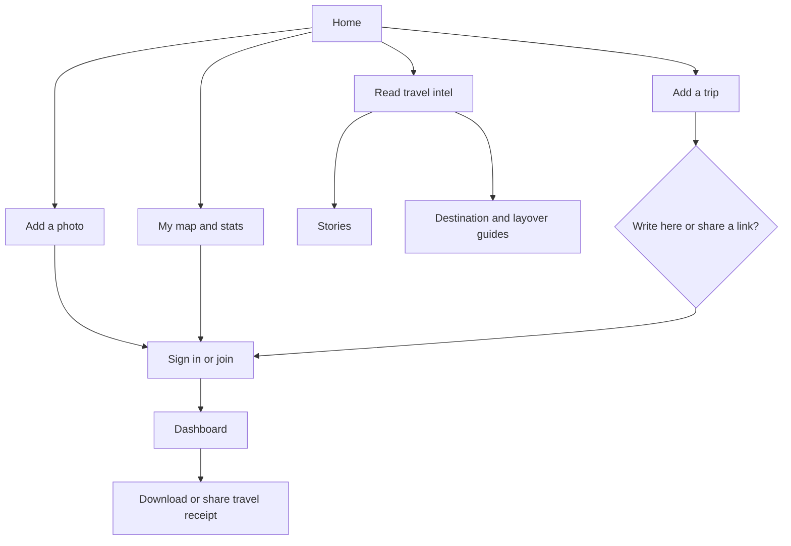

# That Layover Life: user-flow, UX, accessibility, SEO and AEO audit

**Review date:** 9 October 2026  
**ICP:** a young traveler who wants to contribute a story or link, share photos, keep a map and visit count with shareable personal outputs, and read useful travel information.

## Executive assessment

That Layover Life already has a distinctive editorial world and a strong public reading experience. The strongest promise is clear: real people, specific places, dated trips, human editing. The site is weakest at turning that promise into a repeatable member habit. A new traveler can read, but the path from “I want to share this trip” to “I have a profile, map, story and shareable result” is split across several labels and hidden behind sign-in.

The highest-value work is:

1. Make the four ICP jobs the primary information architecture: **Read, Add a trip, Add a photo, See and share my map**.
2. Make the logged-out preview explain exactly what a member gets, then preserve the intended destination after sign-up or login.
3. Repair the search result state, map fallback, count consistency and public guide QA status.
4. Turn the account into a visible “travel receipt” dashboard with downloadable/social share cards.
5. Build answer-ready destination and guide pages around real questions, evidence, dates and sources.

## Journey findings

| Journey | Current path | What works | Friction or failure | Priority |
|---|---|---|---|---|
| Read and learn | Home → Stories / Destinations / Guides | Strong editorial voice, filters, dated places, named authors and useful guide sections | The library currently displays nine stories but the footer still says six. Search reports one match for “Patagonia” while all nine cards remain visible in the DOM and on screen | P0 |
| Share an external story link | Home → Share your story → sign in → account | The underlying form explains link title, country, summary, paywall disclosure and lightweight review | The signed-out gate hides the fact that a link contribution is supported. A visitor cannot choose “link” versus “write here” before creating an account | P1 |
| Write an article | Home → Share your story → sign in → editor | Excellent submission model: autosave, country/date, story metadata, credit modes, sponsorship disclosure, photo limits and editorial promise | Too many fields before the writer has reached the first sentence. “Start anywhere” conflicts with the amount of required metadata. Need a progressive two-stage composer | P1 |
| Share photos | Home → gallery / Add yours → sign in | Clear promise: no full story required; context, credit, copyright and EXIF choices are thoughtfully explained | The user discovers the actual uploader only after sign-in. Add a public preview of the five-step process and expected image rules before the gate | P1 |
| Build map and count visits | Home → map → edit destinations / logbook | Rich concept: countries, cities, airports, parks, heritage, motion and pet layers. Labels are unusually memorable | Public map is dominated by the editor’s numbers, so the new user does not know whether they are seeing a demo, site-wide aggregate or personal state. “0 / 195” is unclear before login. The map exposes a WebGL error string when rendering fails | P0 |
| View dashboard and share | Map → account | The account promise mentions stats, stories and pets | Logged-out account is only a sign-in wall. No public explanation of the dashboard’s outputs, no visible share-card examples, and no tested path from a completed map to a shareable artifact | P0 |

## Recommended information architecture

Keep the editorial categories, but add a task layer above them:

Suggested nav labels: **Stories, Guides, My map, Add a trip, Add a photo**. Keep Travelers, Paw Passport and About as secondary navigation. “Destinations” is useful for SEO and browsing, but it is less immediately understandable as a user task than “Guides” or “Places.”

## UX and interaction recommendations

### Homepage

The homepage has a clear editorial hero and good repeated calls to read or contribute. The map is visually ambitious but appears before the visitor understands whether it is a product demo or Nancy’s personal travel record. Put a compact product explanation directly above it: “Track your countries, cities, airports and the trips behind them. Create a free map.” Add one **See an example receipt** CTA and one **Build yours** CTA.

The page is long and repeats several systems: stories, map layers, receipts, seven-item lists, motion embeds, pets and photos. Keep the personality, but establish a stronger rhythm: one job per section, one action, one proof. Move the deep “receipts” and list rulebooks behind “Explore the counting system” or into the member dashboard.

### Contribution

Change the sign-in gate to a choice screen:

- **Write a new story**
- **Share a story already published elsewhere**
- **Drop in photos only**

Each card should say what is needed, how long it takes, whether the contribution is public, and what the traveler receives afterwards. Preserve `return_to=/submit?mode=...` through auth so the user lands in the right composer.

For the article editor, ask for only title, place, date and first draft first. Save a draft, then request metadata, credits, disclosures and photos as a second “Finish your story” step. This reduces abandonment without losing editorial controls.

### Map and dashboard

Separate three states:

- **Explore TLL’s map**: public stories and editorial layers.
- **Build your map**: the signed-in traveler’s private/editable data.
- **Share your receipt**: a public, privacy-controlled profile or image card.

On the map, show a visible sample mode to logged-out visitors. After sign-in, show a first-run checklist: “Add your first country,” “Add a city,” “Add a photo,” “Publish your first trip.” Provide undo, bulk import, search, and a clear distinction between country visited, airport connection and story published.

The dashboard should include: countries, cities, airports, continents, trips, stories, photos, pets, last updated date and privacy controls. Add one-click outputs sized for Instagram, LinkedIn and a link preview, with an accessible text alternative. A shareable map must never reveal a home address, exact private location or unpublished trip by default.

### Reading

The library’s voice and cards are strong. Fix the search result rendering first: the page says “1 story matching” but the other cards remain visible. Apply filtering to the rendered list, update the result count from the same data source, and announce the result count with an `aria-live` region. Add an empty state with the query, suggested searches and a clear reset.

Add “What you’ll learn” and “Good for” metadata to story cards: time needed, transport, dog-friendly, cost band, season, confidence/date checked and whether it is personal experience or a guide. This improves scanning for younger travelers without flattening the writing.

## Accessibility review

Positive signals include a skip link, semantic headings, labeled search fields, named checkboxes, keyboard browse controls and a cookie-choice interface. The following issues need correction:

- The map’s WebGL failure is exposed as raw implementation JSON. Replace it with plain language: “The interactive map could not load. Browse the country list or open the keyboard view.”
- The map must have a complete non-canvas alternative. Keyboard pins are a start, but the country, city and layer data should be available as a real list/table with links.
- Verify focus visibility, focus order and focus return after opening the layers panel, cookie preferences and any modal.
- Ensure every interactive target meets WCAG 2.2 target-size expectations, especially small layer controls and photo cards. WCAG 2.2 includes Target Size (Minimum) at Level AA. genui{"citation":{"ref":"turn1search13"}}
- Decorative image elements use empty alt attributes in several pages. That is correct only when the image is genuinely decorative; story and gallery images need concise location/context alt text.
- Add reduced-motion handling for map, card and image transitions. Do not make hover the only way to discover a destination.
- Test at 200% zoom, keyboard only, screen reader, touch and a low-power/no-WebGL device.
- Make error and success messages programmatically associated with the relevant form and announced. The form copy is thoughtful, but it needs runtime verification.

## SEO review

The technical foundation is good: HTTPS, robots.txt pointing to a sitemap, canonical URLs on most public pages, descriptive titles and meta descriptions, Open Graph images, and substantial JSON-LD on the homepage. The sitemap contains editorial, destination, guide, contributor, pet and collection URLs, which gives the site a useful topical graph.

Fix these items:

- Add canonical tags to `/share-photos` and `/login`, or confirm the intentional omission is part of a documented private-page policy. Keep contributor and editorial pages indexable where they provide public value.
- Keep `/submit` and `/share-photos` out of search if they are account-gated, but make their public previews genuinely useful and linkable. `noindex, follow` on photo submission is reasonable; the page still needs clear pre-auth information.
- Reconcile counts everywhere. The current public surfaces show nine stories in the library, while footer and account copy still show six. Inconsistent counts weaken trust and can create stale snippets.
- Add `Article` or `BlogPosting` schema to every story with author, datePublished, dateModified, image, headline, description, word count or reading time and `isAccessibleForFree`. Add `ImageObject`/creator credit where relevant.
- Add `BreadcrumbList` consistently to public guide, destination, story, contributor, pet and collection templates.
- Use `ItemList` only where the visible list is the same list represented in the markup. Do not claim a count that differs from rendered cards.
- Add image dimensions, responsive `srcset`, modern formats, lazy loading below the fold and explicit width/height to reduce layout shift. Validate with Lighthouse or PageSpeed on mobile.
- Decide whether query URLs such as `/stories?q=Patagonia` should be indexable. Usually they should be canonicalized to `/stories` and kept out of the sitemap unless they are curated landing pages.
- Add internal links from every story to its country, pillar, contributor and relevant guide. Add a “read next” module based on place, pillar or traveler intent.

Google’s current guidance says the same SEO fundamentals support AI features because those systems retrieve from the normal Search index. genui{"citation":{"refs":["turn1search0","turn1search3"]}}

## AEO and answer-engine review

The Copenhagen stopover page is the right model: it leads with a short answer, asks concrete questions, links to official sources and exposes a “last checked” concept. It currently undermines itself by publicly saying “Draft, not yet checked.” Finish the verification workflow before promoting the page, or label it clearly as an unpublished draft and remove it from navigation and sitemap.

Build an answer system around question clusters:

- Can I leave [airport] during a [length] layover?
- What can I realistically do in [city] in 3, 6 or 9 hours?
- Can I bring a dog through [country] on a stopover?
- How much time should I allow for [airport/route]?
- What does [place] feel like in [month/season]?
- What did a traveler actually spend, carry, eat or encounter on this route?

For each answer page, use one question per H2, give a 40–70-word direct answer, then the personal evidence, source link, last-checked date, author/editor, uncertainty and a related action. Use FAQPage schema only when the visible page genuinely contains a qualifying FAQ, and validate structured data. Add `sameAs` and author identity carefully; never imply official authority where the page is personal experience.

Create a source ledger in the CMS with source URL, publisher, checked date, claim supported, jurisdiction and expiry/review date. This is especially important for visas, EES/ETIAS, airline rules, pet entry and public transit. Google’s guidance continues to emphasize useful, original, people-first content and normal Search quality systems for AI visibility. genui{"citation":{"ref":"turn1search0"}}

## Brand, editorial and visual system

The voice is a real strength: specific, funny, self-aware and recognizably Nancy. The visual system also has a strong signature through cream, ink, rose, oversized editorial serif and compact mono labels. Protect that character while reducing cognitive load.

Use the same verbs across the product. “Share your story,” “Submit your shot,” “Edit my destinations,” “Open the full map,” “Your shelf” and “Account” currently describe related actions in different dialects. Create a small controlled vocabulary and reserve playful copy for supporting lines.

The photography promise is stronger than the current gallery inventory. The gallery says all frames are currently by Nancy, which is honest, but it makes the contributor value proposition feel hypothetical. Add contributor examples, photo rights/credit examples and a public “how it appears” preview before sign-in.

## Prioritized backlog

### P0: repair trust and task completion

- Fix story search filtering and result count.
- Replace WebGL error output with a plain-language fallback and full accessible list.
- Reconcile story, country and pet counts across header, footer, library, sitemap and account.
- Surface the four member jobs and preserve the selected contribution mode through auth.
- Remove “Draft, not yet checked” from the promoted Copenhagen guide or complete its source review.
- Confirm every account route has a useful logged-out preview and a clear return path.

### P1: make the product habit-forming

- Reframe nav and homepage around Read, Add a trip, Add a photo and My map.
- Add dashboard stats and downloadable/social share receipts.
- Split the article composer into draft first and metadata second.
- Add public examples of map cards, story cards, photo cards and privacy settings.
- Add destination and guide templates with question-led headings, source ledger and last-checked dates.

### P2: scale discovery and polish

- Add Article/ImageObject/Breadcrumb schema templates and validate them.
- Improve story card metadata and related-content links.
- Optimize image delivery, responsive art direction and reduced motion.
- Add contributor onboarding, referral links and post-publish prompts to share a receipt.
- Instrument events: `story_start`, `story_draft_saved`, `story_submitted`, `link_submitted`, `photo_upload_started`, `photo_submitted`, `map_country_added`, `share_receipt_clicked`, `guide_source_clicked`.

## Suggested acceptance criteria

- A first-time visitor can explain the four core jobs within 10 seconds.
- A contributor can choose article, external link or photo before signing in.
- After auth, the user returns to the selected composer with no lost context.
- Search results, result count, URL state and screen-reader announcement agree.
- The map remains usable with WebGL disabled, JavaScript partially delayed, keyboard only and a screen reader.
- A traveler can add a country, see an updated count, choose privacy, download a receipt and copy a share link in one session.
- Every public guide exposes its answer, source, author and last-checked status in the rendered page and structured data.

